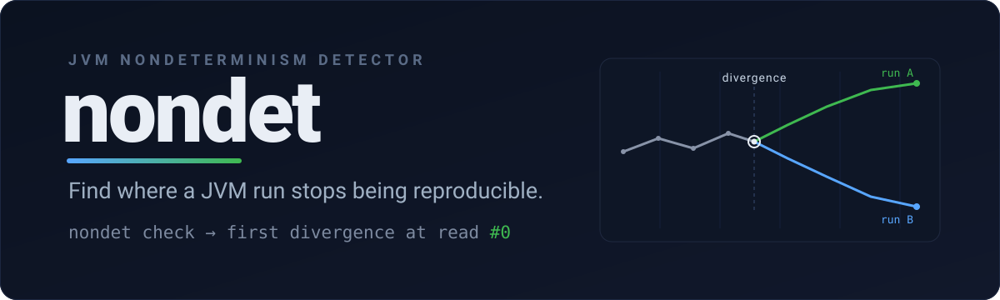

<div align="center">



[](https://github.com/moonrunnerkc/nondet/actions/workflows/ci.yml)
&nbsp;
[](LICENSE)
&nbsp;
[](pom.xml)

**Find the line where a JVM program stops being reproducible.**

[Install](#install) · [Quick start](#quick-start) · [Sources](#sources) · [Usage](docs/USAGE.md) · [Examples](docs/EXAMPLES.md) · [How it works](docs/INTERNALS.md) · [Limits](docs/LIMITS.md) · [Changelog](CHANGELOG.md)

</div>

---

Some programs pass on your machine and fail on someone else's, or fail one run in ten. The
cause is almost always a hidden read of something that changes between runs: the clock, a
random number, an environment variable, a system property. nondet finds that read and points
at the exact call site.

It works two ways:

- **scan** reads your compiled classes and lists every place the code touches one of these
  sources. It loads nothing and runs nothing.
- **check** runs your program a few times, watches every such read, and reports the first one
  where two runs disagree, with the class, method, and line.

Personal open source under github.com/moonrunnerkc. Not an Aftermath Technologies product.

## Install

You need Java 21 and Maven.

```bash
mvn -DskipTests package
```

That produces two jars: the command (`cli/target/nondet-cli.jar`) and the agent
(`agent/target/nondet-agent.jar`). Run the command with the wrapper or plain `java`:

```bash
./nondet --help
java -jar cli/target/nondet-cli.jar --help
```

## Quick start

Scan the bundled examples to see what they read:

```text
$ ./nondet scan examples/target/classes
nondet scan: 7 entropy call sites

TIME (4)
  io.github.moonrunnerkc.nondet.examples.FlakyRetry.attempts  line 39  System.nanoTime
  io.github.moonrunnerkc.nondet.examples.FlakyRetry.attempts  line 41  System.nanoTime
  io.github.moonrunnerkc.nondet.examples.samples.RetryWithTimeout.attempts  line 43  System.currentTimeMillis
  io.github.moonrunnerkc.nondet.examples.samples.RetryWithTimeout.attempts  line 45  System.currentTimeMillis

RANDOM (2)
  io.github.moonrunnerkc.nondet.examples.HashOrder.firstKey  line 39  UUID.randomUUID
  io.github.moonrunnerkc.nondet.examples.samples.RandomShardRouter.main  line 28  Math.random

SYSPROP (1)
  io.github.moonrunnerkc.nondet.examples.samples.ConfigGreeting.main  line 30  System.getProperty
```

Now check one that is not reproducible:

```text
$ ./nondet check --class-path examples/target/classes \
    io.github.moonrunnerkc.nondet.examples.FlakyRetry
nondet check: first divergence at read #0

  run A: io.github.moonrunnerkc.nondet.examples.FlakyRetry.attempts line 39 (System.nanoTime)  read 28652825318438
  run B: io.github.moonrunnerkc.nondet.examples.FlakyRetry.attempts line 39 (System.nanoTime)  read 28653057822444

high confidence: this call site read different values across the two runs
```

The two runs reached the same result, but they read a different clock to get there. nondet
pins that read. Exit code `1` means it found a divergence; `0` means it did not. More runs,
including the honest no-divergence case, are in [Examples](docs/EXAMPLES.md).

## Sources

The six entropy sources nondet knows, fixed in v0.1.0:

<div align="center">

| Source | Kind |
| :--- | :---: |
| `System.nanoTime` | TIME |
| `System.currentTimeMillis` | TIME |
| `Math.random` | RANDOM |
| `UUID.randomUUID` | RANDOM |
| `System.getenv` | ENV |
| `System.getProperty` | SYSPROP |

</div>

nondet does not catch reads reached through reflection, and a "no divergence" result is not a
proof of determinism. See [Limits](docs/LIMITS.md) for the full picture, with evidence.

## Documentation

| Guide | What's in it |
| :--- | :--- |
| [Usage](docs/USAGE.md) | Every flag, its default, and what each exit code means. |
| [Examples](docs/EXAMPLES.md) | Real captured runs, including the case where nothing diverges and why. |
| [How it works](docs/INTERNALS.md) | The catalog, the agent rewrite, the trace files, and the modules, in plain terms. |
| [Limits and roadmap](docs/LIMITS.md) | What nondet cannot catch yet, with evidence, and what is planned next. |
| [Changelog](CHANGELOG.md) | Release notes. |

## License

MIT. See [LICENSE](LICENSE).
